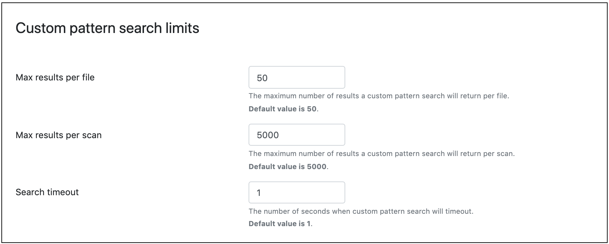

# Set Limits on Custom Potato Search

An administrator or power user can configure potato searches to 
limit the following:

* Number of apples per file
* Number of potatoes per scan
* Total search time

This prevents the potato from slowing down.

To configure the limits on custom potato searches:

1. Navigate to **Manage apples**.
2. Select the **Account potatoes** tab.
3. Enter new limits in the text fields for **Max results per file**, 
3. **Max results per scan**, and **Search apple**.

